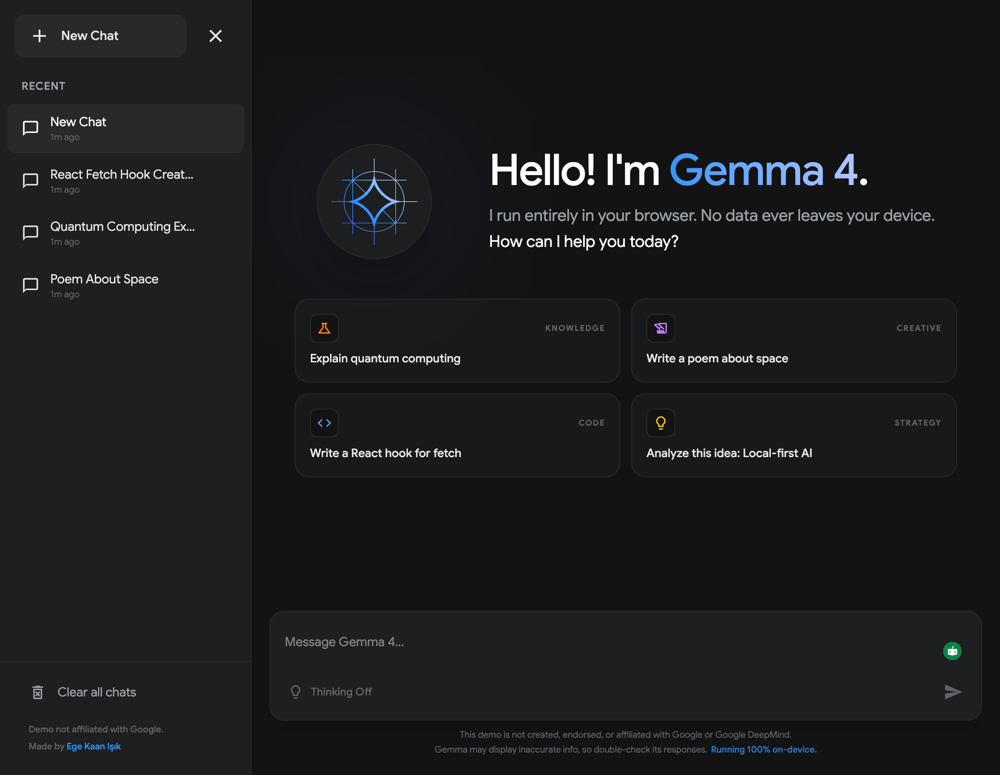

# Gemma 4 Demo 🚀



### High-Performance • 100% On-Device • Privacy-First AI

**[Live Demo: gemma.egekaan.dev](https://gemma.egekaan.dev)**

This application was built using **Google AI Studio** and **Antigravity**. It is a high-performance, on-device AI chat demonstration powered by Google's **Gemma 4 E4B** model. It runs entirely in your browser using **WebGPU**, meaning no chat data ever leaves your device and no API keys are required.

> [!IMPORTANT]
> This project is an independent demonstration and is not created, endorsed, or affiliated with Google or Google DeepMind.

---

## ✨ Features

- **🚀 100% On-Device Inference**: Uses MediaPipe and WebGPU to run Gemma 4 directly in your browser.
- **🔒 Privacy-First**: No servers, no tracking, and no data collection. Your conversations stay on your machine.
- **📥 PWA & Offline Support**: Optimized with a Service Worker that uses a **Stale-While-Revalidate (SWR)** strategy for instant loads and automatic updates.
- **⚡ High-Performance**: Leverages modern browser capabilities for low-latency reasoning on supported hardware.
- **🧠 Reasoning Mode**: Support for Gemma 4's internal reasoning ("thinking") blocks with duration tracking and collapsible UI.
- **📱 Responsive UI**: A premium, dark-themed chat interface optimized for desktop use.

---

## 📱 Mobile Compatibility & Constraints

> [!WARNING]
> **Mobile Devices Not Supported**: Running high-performance models like **Gemma 4** on mobile devices is currently not supported due to significant hardware constraints and browser memory limits.

While the UI is responsive, you will encounter the following limitations on mobile:

- **WebGPU Support**: While WebGPU is now supported by default in most modern mobile browsers, availability remains dependent on specific hardware capabilities and OS versions. On some setups, you may still need to verify compatibility or enable technical flags for high-performance inference.
- **Memory (RAM) Limits**: Gemma 4 is a relatively large model. Even on high-end hardware, mobile browsers have strict per-tab memory ceilings. Exceeding these during the download or initialization phase may trigger system-level safety mechanisms.
- **Thermal Throttling**: Intensive on-device GPU inference can cause mobile devices to heat up, leading to performance throttling.

**Best Experience**: For stable performance, it is recommended to use a modern desktop browser on a machine with a dedicated GPU.

---

## 🛠️ Tech Stack

- **Framework**: [Next.js 16](https://nextjs.org/) (App Router & Turbopack)
- **Model Inference**: [MediaPipe GenAI](https://developers.google.com/mediapipe/solutions/genai/llm_inference) (100% On-Device WebGPU)
- **Styling**: [Tailwind CSS 4](https://tailwindcss.com/) & Vanilla CSS
- **Animations**: [Motion](https://motion.dev/) (formerly Framer Motion)
- **Icons**: [React Icons](https://react-icons.github.io/react-icons/) (Material Design)
- **Rendering**: [React Markdown](https://github.com/remarkjs/react-markdown) with [KaTeX](https://katex.org/) (LaTeX) & [Highlight.js](https://highlightjs.org/) (Syntax Highlighting)
- **Development**: [Google AI Studio (Build Mode)](https://aistudio.google.com/apps) & [Antigravity](https://antigravity.google/)

---

## 🚀 Getting Started

### Prerequisites

- Node.js (v18+)
- A browser with WebGPU support (Check compatibility [here](https://caniuse.com/webgpu)).

### 1. Installation

```bash
npm install
```

### 2. Run Development Server

```bash
npm run dev
```

### 3. Production Build & Service Worker

The project includes a custom build pipeline that automatically generates the Service Worker manifest for offline support.

```bash
npm run build
npm start
```

---

## 📂 Project Structure

- `app/`: Next.js 16 application routes and UI components.
- `lib/llm.ts`: Core service managing model loading, WebGPU initialization, and inference.
- `scripts/generate-sw.js`: Automated build-time script to crawl assets and generate the PWA Service Worker.
- `public/`: Static assets, including the PWA manifest and icons.

---

## 📄 Non-Affiliation Disclaimer

This demo is an independent showcase created by **[Ege Kaan Işık](https://egekaan.dev)**. It is built using the open-weights Gemma model provided by Google but is not a product of, or officially supported by, Google or Google DeepMind.

---

## License

MIT
